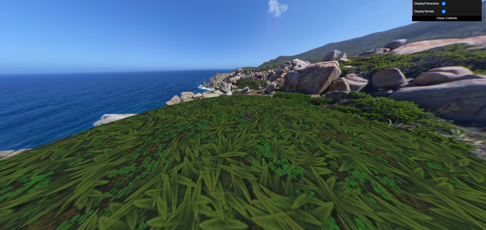
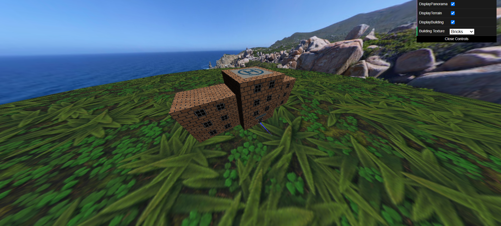
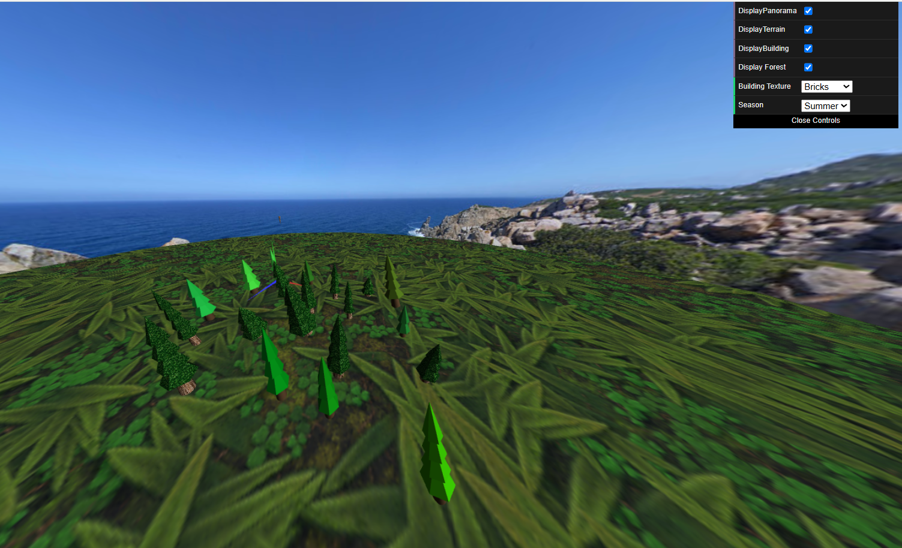
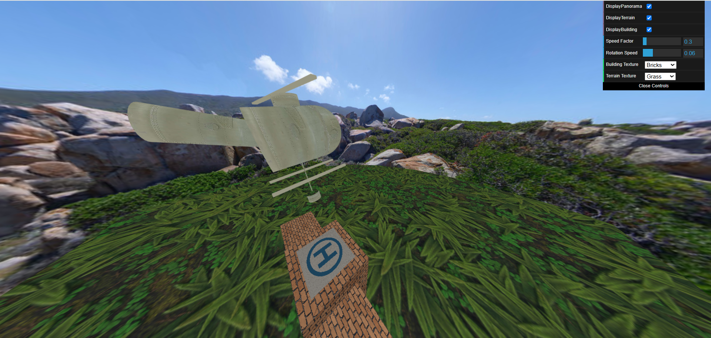
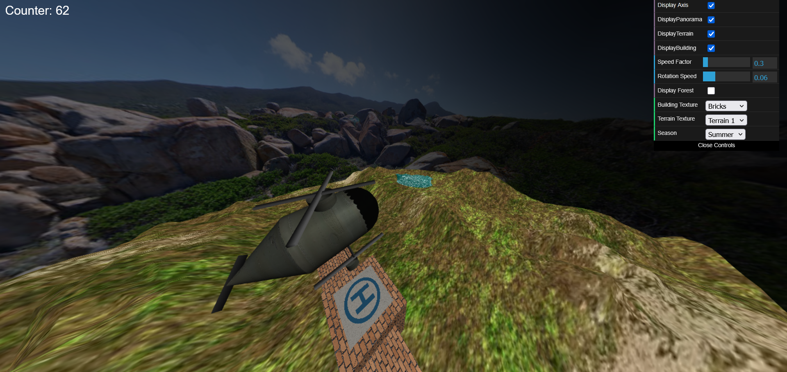

# CG 2024/2025

# TODO LIST

- Parametrizar Panorama
- Fix helicopter velocity
- Extinguish Fire

## Group T02G03

## Project Notes

### Part 1 - Sky-Sphere

### Part 2 - Fire-fighters Building

Na implementacao da classe **MyBuilding**, optou-se por passar uma textura em vez de uma cor como argumento do construtor. Além disso, é possível selecionar entre escolher várias texturas para o edifício, o que permite um maior realismo e facilita a personalização do seu aspeto.

### Part 3 - Trees and Forest

### Part 4 - Helicopter

#### Helicopter Modeling

#### Final Helicopter

