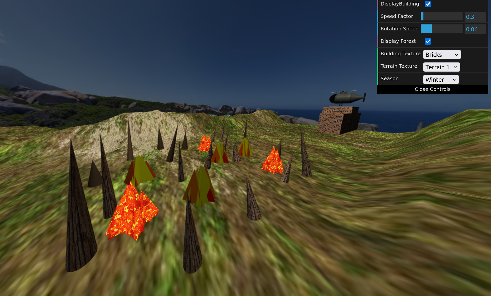

# CG 2024/2025

## Group T02G03

| Group Member            | Student Number | Contribution |
|-------------------------|---------------|--------------|
| Paulo Coutinho          |202205692      | 50%          |
| Nuno Saavedra Machado   |202206186      | 50%          |

## Project Notes

| Explicação | Imagem |
| --- | --- |
| **Part 1 - Sky-Sphere** |  |
| **Part 2 - Fire-fighters Building** Na implementação da classe **MyBuilding**, optou-se por passar uma textura em vez de uma cor como argumento do construtor. Além disso, é possível selecionar entre escolher várias texturas para o edifício, o que permite um maior realismo e facilita a personalização do seu aspeto. |  |
| **Part 3 - Trees and Forest** Na implementacão da classe **MyTree**, em vez de passar diretamente a cor da copa como parâmetro, é utilizado um valor booleano que indica se a árvore vai usar ou não textura. Se não usar textura, irá ter diferentes tons de verde. Caso utilize textura, é aplicada a textura que está especificada no último argumento do construtor. Na implementacao da classe **MyForest**, foi utilizado um desvio aleatório (offset) à posicão de cada árvore, de forma a evitar a formação de uma grelha perfeita e tornar a distribuição mais natural. Adicionalmente, por uma questão de criatividade, introduzimos variações subtis na textura e na cor das árvores consoante a estação do ano selecionada. No caso do inverno, apenas o tronco permanece visível. |    |
| **Part 4 - Helicopter** **Helicopter Modeling** |  |
| **Part 4 - Helicopter** **Final Helicopter** |  |
| **Part 5 - Water and Fire** O fogo foi implementado com diferentes pirâmides com altura, rotação e cor variáveis. A classe **MyFire** inclui uma pirâmide central, rodeada por pirâmides com alturas decrescentes consoante a distância ao centro. Tal como nas árvores, o fogo pode ou não usar textura. Quando não utiliza textura, apresenta pirâmides com diferentes tons de amarelo, laranja e vermelho. Quando usa textura, é aplicado um shader que simula uma animação da chama. Esta animação consiste num movimento geométrico, criado por funções sin e cos aplicadas aos vértices, que gere um efeito ondulante nas pirâmides. Além disso, há animação da textura, pois a textura da chama é deslocada ao longo do tempo, criando a ilusão de que está a arder mesmo sem alterar a geometria. Por último, é usado uma máscara de filtro para destacar certas zonas com cores mais brilhantes, acentuando visualmente partes da chama. O fogo é gerado na classe **MyForest**, no ciclo de criação da matriz da floresta, surgindo aleatoriamente entre grupos de quatro árvores. |  |
| **Part 6 - Shaders e animação** Quando o helicóptero sobe ou desce, ocorre uma troca de textura, exibindo intermitentemente o texto correspondente "UP" ou "DOWN". Adicionalmente, são ativadas luzes com propriedades emissivas para reforçar visualmente o movimento vertical da aeronave. Exemplo dos dois tipos de labaredas. |   |
| **Part 7 - Desenvolvimentos adicionais** Consoante o tipo de manobra, o heliporto alterna entre duas texturas: uma com a letra "H" e outra com as letras "DOWN" ou "UP". Durante as transições entre manobras, as texturas são misturadas suavemente, criando um efeito visual contínuo. Esta mistura é realizada com base em shaders.   Um *height map* foi aplicado tanto ao terreno como à água, com o objetivo de simular irregularidades naturais e proporcionar um maior realismo visual ao ambiente. No caso do terreno, o *height map* permite criar relevos, como colinas e depressões, tornando a superfície menos plana e mais próxima do que se observa na natureza. Para a água, a utilização do *height map* resulta numa superfície ondulada, simulando o movimento das ondas e conferindo dinamismo ao cenário. |   |

## Demonstração em Vídeo

- Located in `/video`

<video src="video/project-t02g03-video.mp4" width="600" height="450" controls></video>
