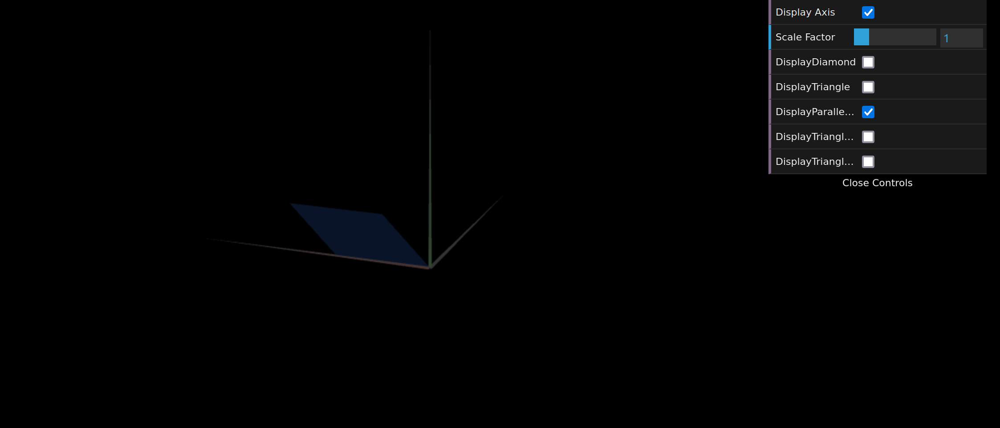

# CG 2024/2025

## Group T02G03

## TP 1 Notes

Exercice 2

We observed the small triangle, like we did in exercice 1.

We observed the big triangle, it is simillar to the small one.

We observed all objects created in this TP.

This parallelogram is double-sided.

