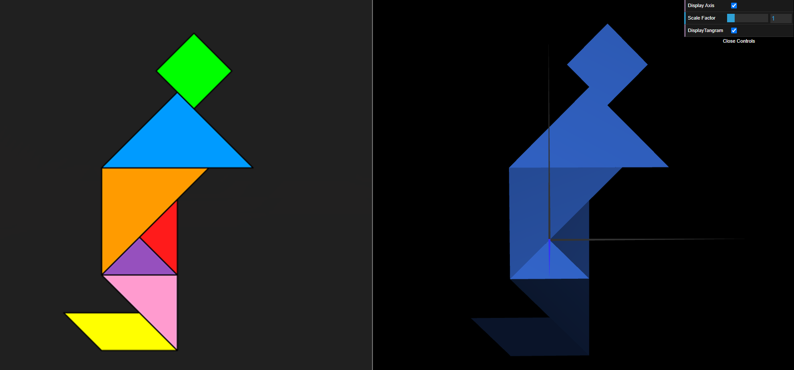
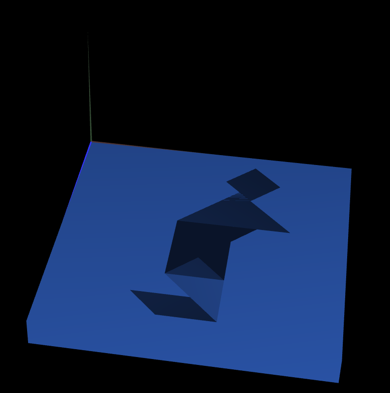
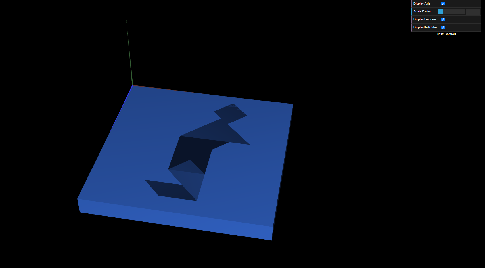

# CG 2024/2025

## Group T02G03

## TP 2 Notes

### Exercise 1

We were able to replicate the Tangram

### Exercise 2

We observed the Tangram on top of the cube, similar to a board

### Exercise 3

We observed the same as the exercise 2

