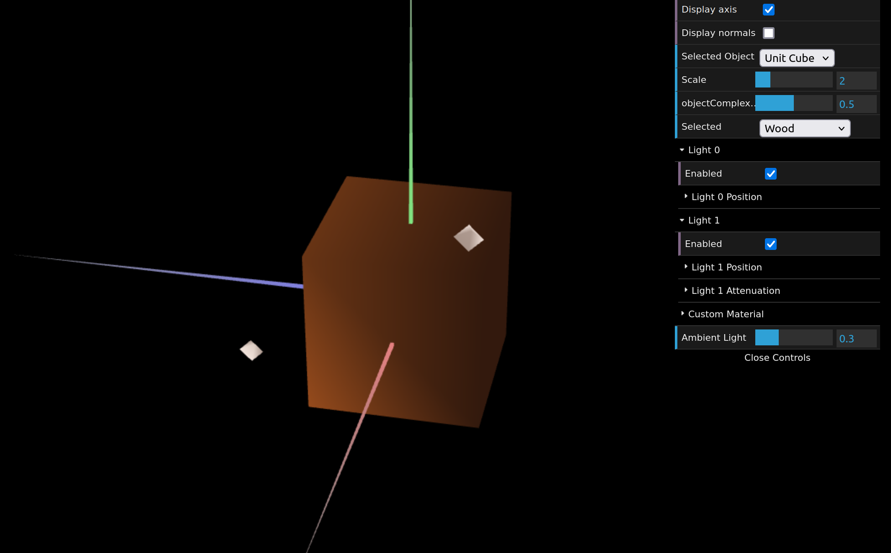
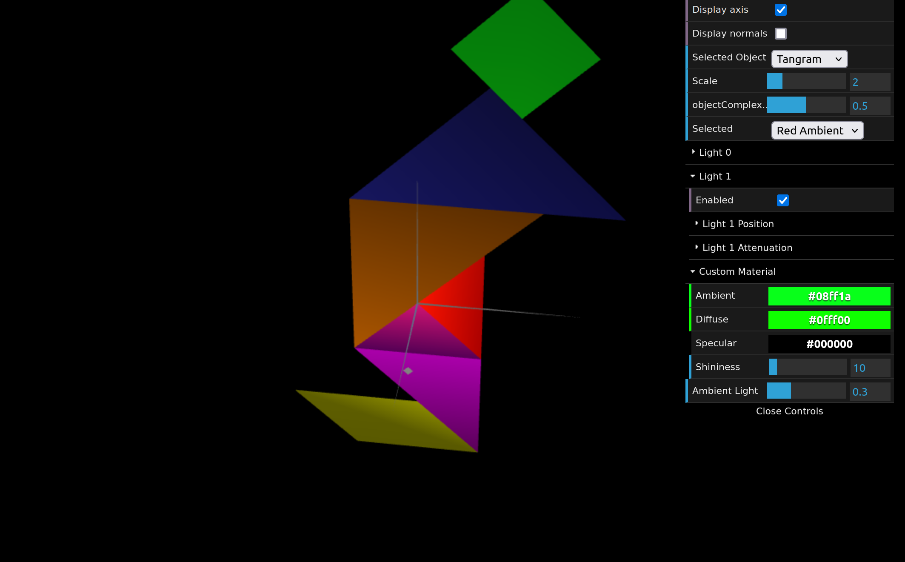
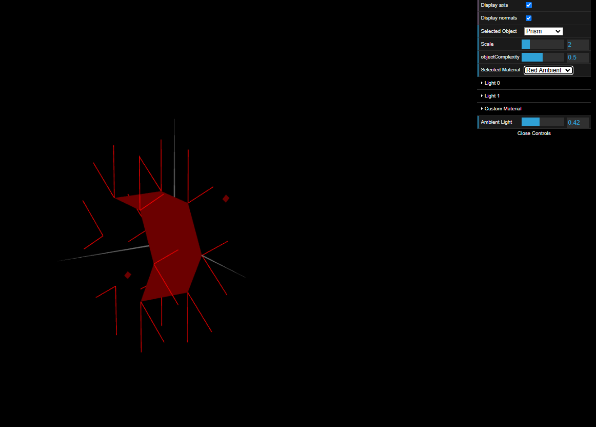
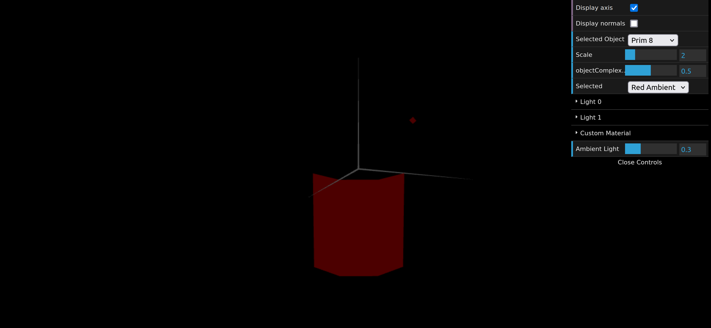
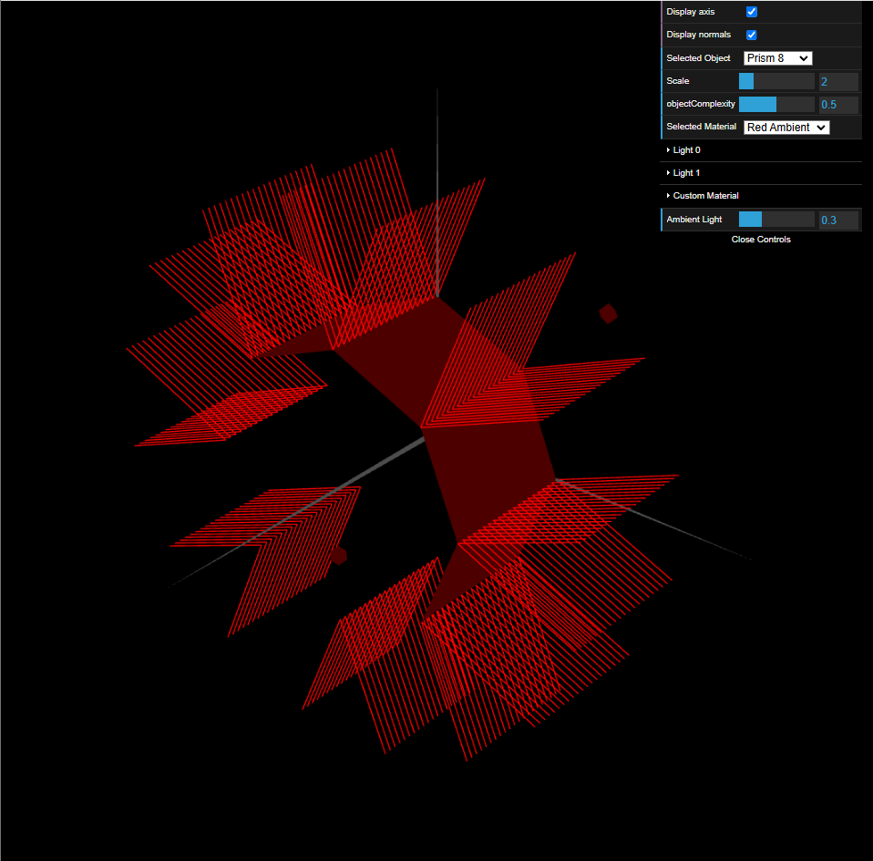
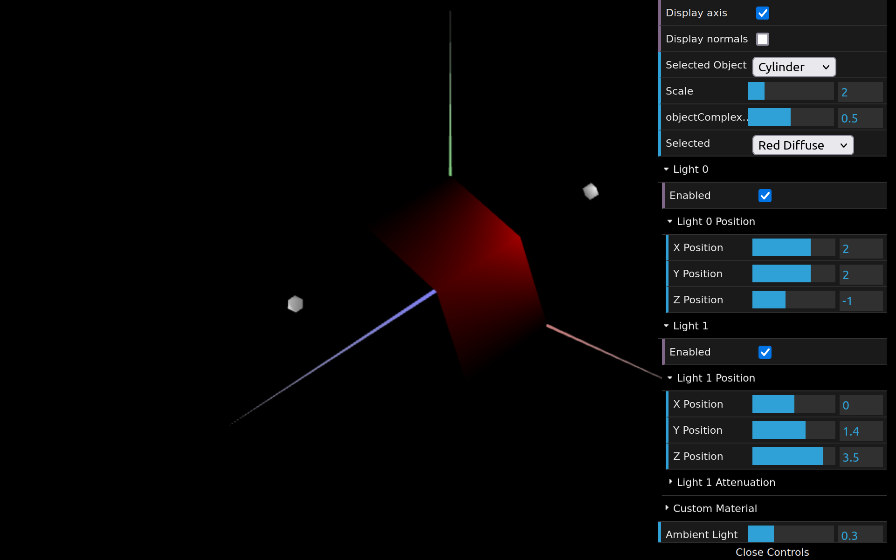

# CG 2024/2025

## Group T02G03

## TP 3 Notes

### Part 1

Críamos um material parecido à madeira, com baixa componente especular e aplicamos no cubo criado no TP2.

Aplicamos vários materiais com elevada componente especular aos componentes do Tangram, cada um com a sua respetiva cor decomposta nas suas componentes (RGB).

### Part 2

Nessa parte 2, foi construído um prisma com um número variável de lados e de "stacks" (ou andares). A orientação das normais das faces desse prisma é tal que elas são perpendiculares a cada face individualmente. Isso faz com que a iluminação calculada tenha um comportamento semelhante ao Constant Shading.

Fazendo variar o número de lados, neste caso com 8, com o mesmo número de andares(1).

A mesma contrução da imagem anterior mas com vários andares, mantendo a mesma proporção.

Nesta parte 3, a direção das normais foi alterada para que fiquem orientadas perpendicularmente à superfície de contato com o cilindro. Essa nova orientação das normais suaviza a iluminação, proporcionando transições mais suaves entre as faces do prisma.

