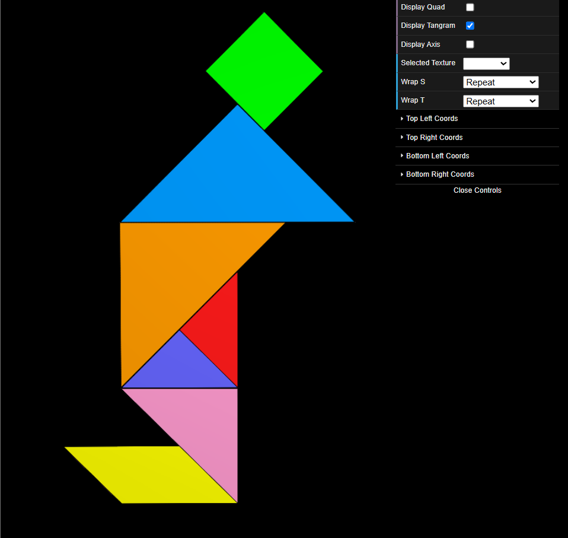
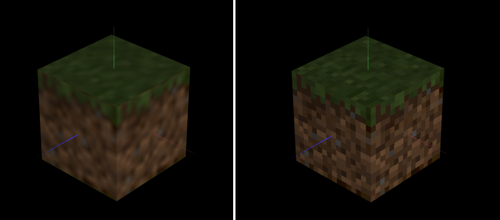

# CG 2024/2025

## Group T02G03

## TP 4 Notes

### Part 1

Mapeamos a textura `tangram.png` para todos os objetos presentes no Tangram. A maior dificuldade foi mapear todas as coordenadas da textura para cada objeto individual, uma vez que esses mesmos objetos tinham transformações lineares aplicadas.

### Part 2

Ao aplicarmos inicialmente a textura, verificámos que a imagem apresentava baixa nitidez. Isto deve-se ao facto de as texturas terem, originalmente, dimensões de apenas 16x16 píxeis, sendo, por isso, insuficientes para cobrir toda a área do cubo. Para obter o efeito e a qualidade desejados, aplicámos um tipo de filtro em todas as faces do cubo, ficando a imagem bastante mais nítida.

