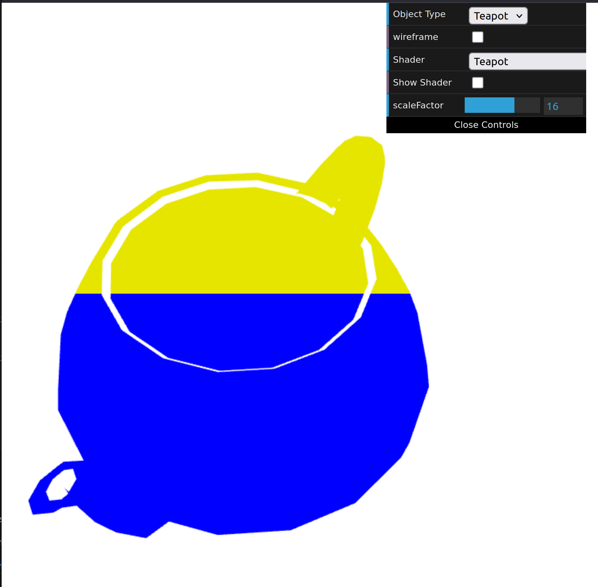
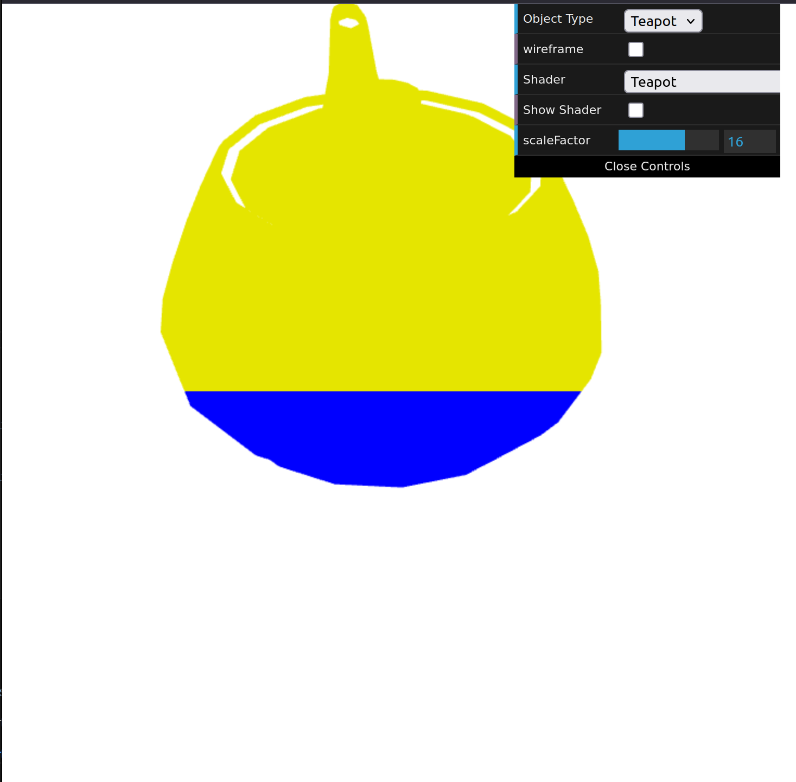
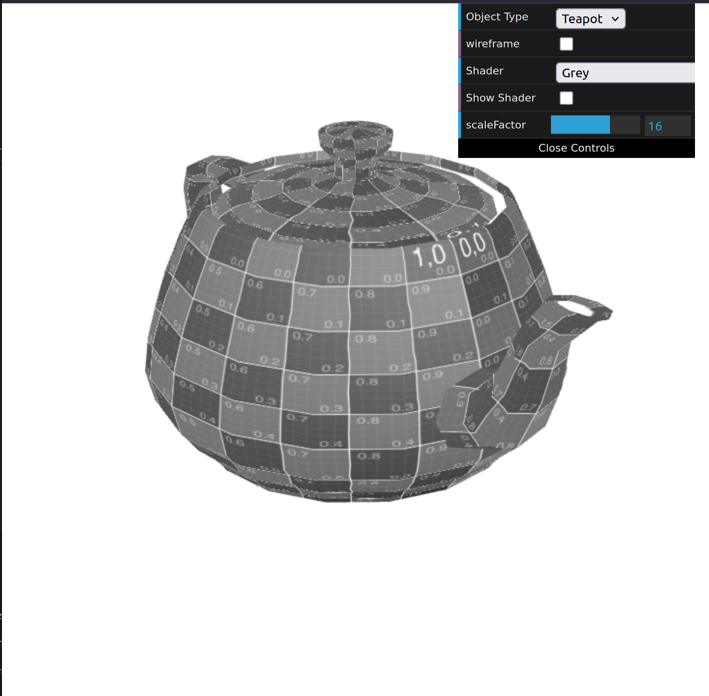
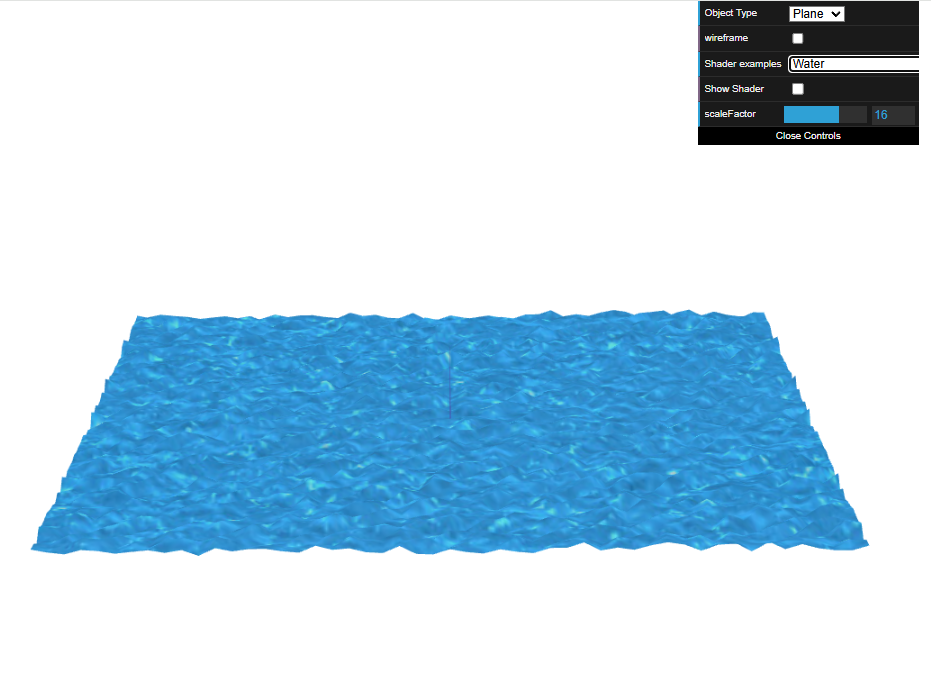

# CG 2024/2025

## Group T02G03

## TP 5 Notes

### Part 1

Para colorir o bule com azul na metade inferior e amarelo na metade superior, foram criados novos shaders. O vertex shader transmitiu a posição dos vértices para o fragment shader, que por sua vez, determinou a cor de cada fragmento com base na coordenada y: azul para valores de y menores ou iguais a 0.5 e amarelo para valores maiores.

Um novo Fragment Shader foi criado para converter cores em tons de cinza. Este shader aplica a fórmula L = 0.299R + 0.587G + 0.114B a cada pixel.

### Part 2

Para simular um efeito de água num plano, foram criados dois novos shaders, water.vert e water.frag, baseados nos shaders de textura existentes. As texturas waterTex.jpg e waterMap.jpg foram aplicadas ao plano, resultando inicialmente numa textura de água com tons vermelhos escuros. O vertex shader foi modificado para utilizar waterMap.jpg como mapa de alturas, deslocando os vértices do plano com base nos valores de cor da textura, criando ondulações. Adicionalmente, foi implementada uma animação nos shaders para variar as coordenadas de textura ao longo do tempo, gerando um efeito de movimento ondulante semelhante a água.

